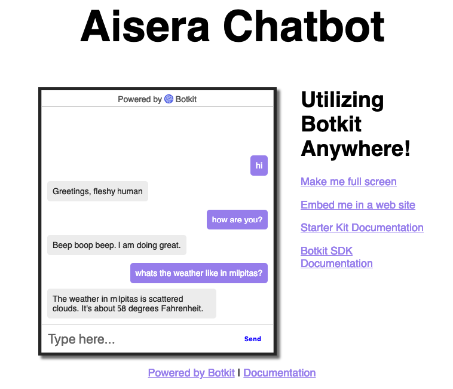

# Aisera Chat Bot

> The Aisera Chat Bot is a *very* simple chat bot that can take general greetings and talk about the weather in some cities.



## Table of Contents

- [Installation](#installation)
- [Features](#features)
- [Embed the Bot](#embed)
- [Technology Used](#technology)

## Installation

There are several API keys needed for this application to run. The keys.js file will be provided separately in an email and should sit in the main folder.

```shell
npm install
nodemon .
```

App is set to run on https://localhost:3000

### Clone

- Clone this repo to your local machine using `https://github.com/Lulzasaur/Aisera`

---

## Features

- Users can have a general greeting with the bot.
- Users can ask general questions about the weather.

A lot of the logic is under the /skills/_hears.js file. 

Greetings
The greetings are split between whether the user is just saying 'hi' or if a user is asking the bot how it is doing.  Wit.ai handles the categorization between the two.

Weather
Weather questions are triggered by the keyword 'weather'. Wit.ai handles the parsing of the request and looks for a city (if it can be found) to return the temperature and weather condition. If none can be found, the bot indicates so.

---

## Embed the Bot

The bot can be embeded into a website. When the application is running, there is a link on the right hand menu side that provides code on how to embed the bot.

---

## Technology Used

- Wit.ai - `https://wit.ai/`

NLP processor for parsing messages from the user to help categorize responses.

- OpenWeatherMap - `https://openweathermap.org/api`

Open source weather API.

