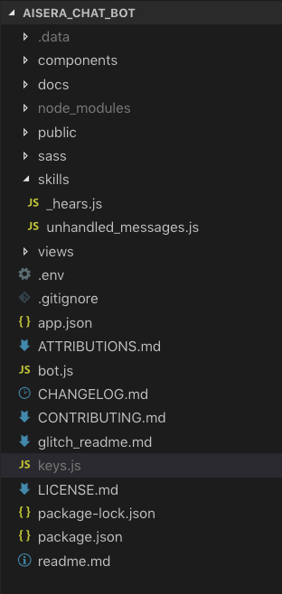

# Aisera Chat Bot

> The Aisera Chat Bot is a simple 

## Table of Contents

- [Installation](#installation)
- [Features](#features)
- [Technology Used](#technology)

## Installation

There are several API keys needed for this application to run. The keys.js file will be provided separately in an email and should sit in the main folder.


```shell
npm install
nodemon .
```

App is set to run on https://localhost:3000

### Clone

- Clone this repo to your local machine using `https://github.com/Lulzasaur/Aisera`

---

## Features

- Users can have a general greeting with the bot.
- Users can ask general questions about the weather.


---

## Technology Used

- Wit.ai - `https://wit.ai/`

NLP processor for parsing messages from the user to help categorize responses.

- OpenWeatherMap - `https://openweathermap.org/api`

Open source weather API.

